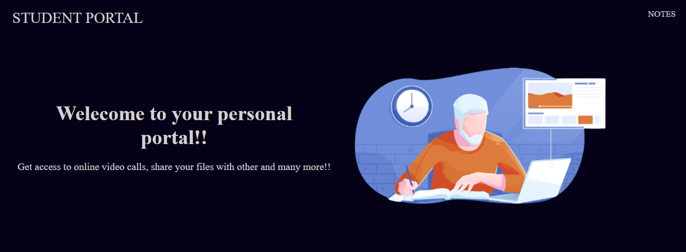

<h1>Student Portal</h1>
<h2>About the project</h2>

It is an online web application specially designed for students to help them in studies. It consists of the features like online video application where the students can discuss and share their thought with their friends
,it also has the file sharing features where student can upload and share any file with anyone

  

<h2>Technology used:</h2>
<ul>
<h3>Frontend:</h3>
<ul>
<li>HTML</li>
<li>CSS</li>
<li>JavaScript</li>
<li>Bootstrap</li>
</ul>

<h3>Backend:</h3>
<ul>
<li>Node.Js</li>
<li>EJS</li>
<li>Socket.io</li>
<li>MongoDb</li>
<li>Passport</li>

</ul>

<h2>Features:</h2>
<h3>Online video Chat application:</h3>

  <h3>Online File Sharing Application:</h3>
  
  <h3>Notes application</h3>
  
  
<h2>Steps to run locally:</h2>
<ul>
<li>Clone the repo in your pc</li>
<li>run command-- npm install</li>
<li>Go to localhost:3000 in your browser.</li>
</ul>
<h2> Deployed link</h2>
<a href="https://studentportall.herokuapp.com/">Click here to visit website</a>
